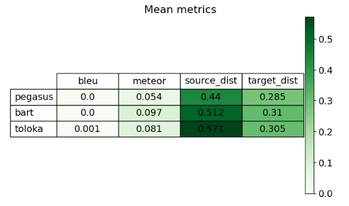
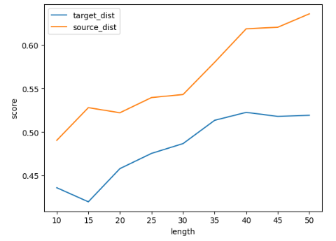

# summarization_testing
Пайплайн сравнения моделей для суммаризации текстов

Для сравнения были выбраны модели: [bart](https://huggingface.co/facebook/bart-large-cnn) , [pegasus](https://huggingface.co/google/pegasus-xsum) , [toloka](https://huggingface.co/toloka/t5-large-for-text-aggregation)

На reddit части датасета ConvoSumm я замерял:

1. bleu score
2. meteor score
3. Косинусное расстояние до эмбеддинга текста
4. Косинусное расстояние до эмбеддинга эталонного сокращения из датасета

Результаты:

Bleu score оказался не валиден для оценки, так как слишком чувствителен к перефразированию.
Meteor score уже не такой низкий, из-за частичного совпадания слов в сокращении моделей и эталонном сокращении.
Я считаю, что source_dist и target_dist можно считать более репрезентативными метриками, так как они учитывают схожесть реального смысла текстов.
Можно сделать вывод, что toloka и bart лучше, чем pegasus.

Также если поставить эксперемент на toloka модели, видно, что чем больше длинна генерируемого текста, тем лучше качество:
